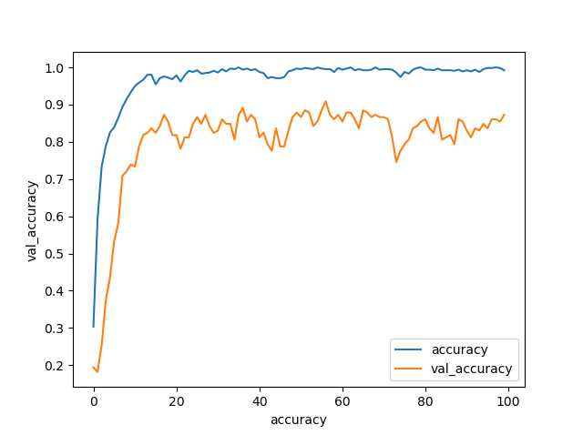
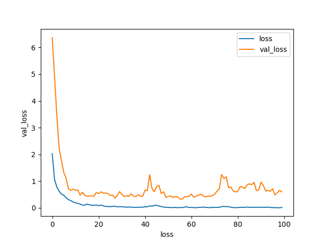

# Speech Recognition 

> An example of audio classification Based CNN 
> The model classify an audio into 10 class  
> You can download the here [Dataset ](https://www.kaggle.com/andradaolteanu/gtzan-dataset-music-genre-classification)  

>For a better understood of sound ai you can look this link [Sound AI](https://hyunlee103.tistory.com/36?category=999732)

# Training loss 

